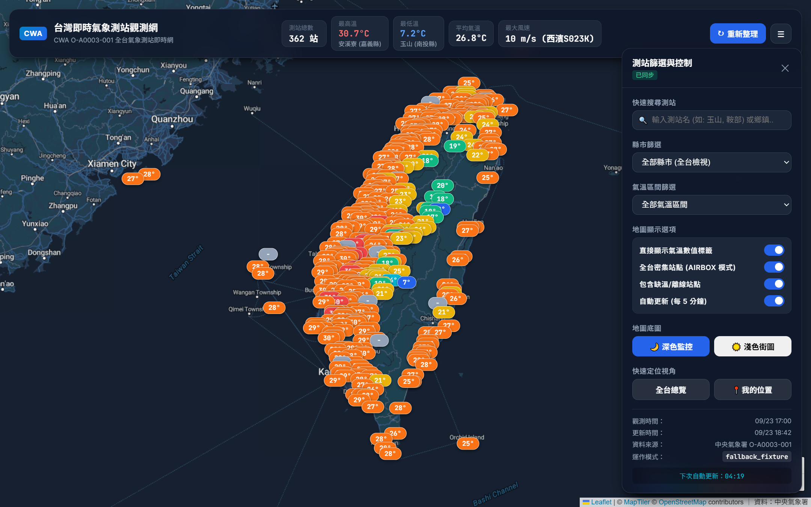

# AIoT-DA L3 HW1｜台灣氣象測站 GIS Dashboard

本專案為 AIoT-DA 第三課 Homework 1，使用中央氣象署（CWA）開放資料建置一個以台灣地圖為核心的氣象測站 Web App，並完成 GitHub 版本管理與 Vercel 雲端部署。

- **GitHub Repository：** https://github.com/prometheans152/0923
- **Vercel Production：** https://0923-site.vercel.app/
- **GitHub Pages：** https://prometheans152.github.io/0923/
- **CWA Dataset：** `O-A0003-001`（氣象觀測站－10分鐘綜觀氣象資料）

> 本報告依照課堂要求，以「目的 → 步驟 → 結果 → 討論」的 Homework 報告形式整理，並以五個 Gate 管理與驗證開發流程。

---

## 成果畫面



---

# 一、作業目的

本次作業的目標不是只做出一個網頁，而是練習把一個較完整的 AI Coding 專案拆解成可管理、可驗證的流程。

主要目的如下：

1. 從中央氣象署 Open Data 取得氣象測站資料。
2. 將原始資料進行清理、標準化並保存成前端可使用的資料格式。
3. 使用 GIS 地圖呈現全台氣象測站與溫度分布。
4. 使用 GitHub 進行版本管理與自動化測試。
5. 將專案部署到 Vercel，讓網站可由公開網址存取。
6. 練習以 AI Agent 協助規劃、實作、測試與除錯，而不是只用一次性 Prompt 完成整個專案。

本專案參考課堂展示的 AirBox 與 Taiwan Weather Map 概念，將「地圖優先」、「高密度測站」、「溫度色階」、「測站細節」與「即時監控介面」整合在同一個 Dashboard。

---

# 二、系統架構

本專案分成資料處理、前端 GIS、版本管理與雲端部署四個主要部分。

```mermaid
flowchart TD
    A[CWA Open Data<br/>O-A0003-001] --> B[Python 資料抓取與清理]
    B --> C[docs/data/stations.json]
    C --> D[Leaflet + Vanilla JS GIS Dashboard]
    D --> E[GitHub Repository]

    E --> F[GitHub Pages]
    E --> G[Vercel]

    G --> H[vercel.json]
    H --> I[@vercel/python]
    I --> J[api/index.py]
    J --> K[Flask server.py]
    K --> D
    K --> L[/api/weather]

    M[GitHub Actions] --> B
```

### 使用技術

| 類別 | 技術 |
|---|---|
| 資料來源 | CWA Open Data API |
| Dataset | O-A0003-001 |
| 資料處理 | Python |
| 前端 | HTML / CSS / Vanilla JavaScript |
| GIS | Leaflet |
| 地圖底圖 | MapTiler Streets v4 / Streets v4 Dark |
| 後端部署 | Flask + Vercel Python Serverless |
| 版本管理 | Git / GitHub |
| 自動化 | GitHub Actions |
| 測試 | pytest + Node syntax check |

---

# 三、開發流程：Five Gates

## Gate 1｜取得與整理 CWA 氣象資料

### 工作內容

第一關的工作是取得中央氣象署資料，並確認程式真的能將資料轉換成網站可以使用的格式。

本專案使用：

```text
O-A0003-001
氣象觀測站－10分鐘綜觀氣象資料
```

Python 程式負責：

- 解析 CWA JSON。
- 取得測站名稱、縣市、鄉鎮、經緯度。
- 取得氣溫、濕度、風速、降水、氣壓與觀測時間。
- 清除 `-99`、`-999`、空值等無效資料。
- 建立統一的前端資料 Schema。
- 計算全台最高溫、最低溫、平均溫度與最大風速等摘要資訊。

### 驗證方式

檢查 `docs/data/stations.json` 的 metadata 與測站資料。

### 驗證結果

目前 committed artifact 的內容為：

| 項目 | 結果 |
|---|---:|
| Dataset | O-A0003-001 |
| 測站總數 | 362 |
| 有效溫度測站 | 351 |
| Snapshot 觀測時間 | 2026-09-23 17:00 +08:00 |
| 資料模式 | `fallback_fixture` |

### 資料模式說明

程式本身支援在伺服端提供 `CWA_API_KEY` 後抓取 CWA API；但目前 GitHub / Vercel 上 committed 的 `stations.json` 是 **fallback fixture snapshot**，因此本報告不將這份 deployed artifact 誤稱為「目前即時資料」。

這個 fallback 設計的目的，是在沒有 API Key、網路錯誤或開發環境離線時，仍能完整測試 GIS、篩選、Marker、圖例與 UI。

**Gate 1：PASS（資料解析、正規化與可視化輸入已驗證；目前部署資料為 snapshot fallback mode）**

---

## Gate 2｜資料持久化與標準化輸出

### 工作內容

課堂示範使用 SQLite 儲存資料；本專案則採用 **Sanitized JSON Artifact**：

```text
docs/data/stations.json
```

資料流程為：

```text
CWA raw JSON
    ↓
normalize.py
    ↓
清除無效值 / 統一欄位 / 驗證座標
    ↓
stations.json
    ↓
Frontend / Flask API
```

### 為何這次使用 JSON，而不是 SQLite

本專案目前的需求主要是「讀取最新一批測站資料並顯示」，沒有在網站上寫入或查詢歷史資料，因此 JSON 有幾個優點：

- 架構簡單。
- GitHub Pages 可以直接讀取。
- Vercel Serverless 也能直接提供相同資料。
- 容易 Debug 與檢查。
- 不需要處理 Serverless 環境中 SQLite 的寫入持久化問題。

但如果未來要做：

- 歷史溫度查詢。
- 多日趨勢圖。
- 時間序列分析。
- 長期資料保存。

則 SQLite、PostgreSQL 或 Supabase 會比單一 JSON 更適合。

### 驗證方式

- 驗證 JSON Schema。
- 驗證每個測站具有合法座標。
- 驗證無效 Sentinel Values 不會破壞前端。
- 使用 pytest 自動化測試。

### 驗證結果

```text
pytest
13 passed
```

**Gate 2：PASS（本專案採 JSON artifact persistence；與課堂 SQLite 示範不同，但資料持久化與 Schema 驗證已完成）**

---

## Gate 3｜建立 Taiwan GIS Web App

### 工作內容

第三關將資料實際放到台灣地圖上。

前端使用 Leaflet，主要功能包含：

- 台灣置中地圖。
- 全台測站 Marker。
- Marker 依氣溫自動變色。
- 點擊測站顯示詳細資料。
- 測站名稱搜尋。
- 縣市篩選。
- 氣溫範圍篩選。
- 溫度文字標籤。
- 全台摘要統計。
- 手動 Refresh。
- 自動更新控制。
- 深色 / 淺色底圖切換。
- 7 段溫度 Legend。

### 溫度色階

| 溫度 | 顏色 |
|---|---|
| < 10°C | 藍色 |
| 10–15°C | 青色 |
| 15–20°C | 綠色 |
| 20–25°C | 黃色 |
| 25–30°C | 橘色 |
| 30–35°C | 紅色 |
| > 35°C | 深紅色 |

其中符合課堂要求的主要判斷：

- `<10°C` → 藍色
- `20–25°C` → 黃色
- `>35°C` → 深紅色

### 測站詳細資訊

點擊測站可查看：

- 測站名稱與代碼
- 縣市 / 鄉鎮
- 氣溫
- 相對濕度
- 風速 / 陣風
- 氣壓
- 降水量
- 海拔
- 觀測時間

### 驗證結果

前端 JavaScript 進行語法檢查：

```text
node --check docs/app.js
PASS
```

**Gate 3：PASS**

---

## Gate 4｜GitHub 版本管理與自動化

### 工作內容

完成 Local 專案後，將所有程式碼推送到 GitHub：

**Repository：**  
https://github.com/prometheans152/0923

GitHub 主要負責：

- Source code version control。
- 保存每次修改紀錄。
- GitHub Actions 自動測試與資料建置。
- GitHub Pages 發布靜態版本。
- 與 Vercel Git Integration 連動。

### Security

CWA API Key 不應直接寫入公開 Git Repository。

因此資料抓取程式支援從 Environment Variable / GitHub Secret 讀取金鑰，而不是把 CWA secret hard-code 到前端。

MapTiler 使用的是 Browser API Key；公開前端 Key 本身會出現在瀏覽器 Request 中，因此安全策略是使用 MapTiler 的 Allowed HTTP Origins 限制可使用的網站來源，而不是將它視為後端密碼。

### 驗證結果

```text
branch: main
working tree: clean
pytest: 13/13 PASS
```

GitHub Pages：

https://prometheans152.github.io/0923/

**Gate 4：PASS**

---

## Gate 5｜部署到 Vercel

### 工作內容

為了與課堂示範的 Vercel Python Serverless 架構一致，專案增加：

```text
vercel.json
api/index.py
server.py
requirements.txt
```

Vercel 執行流程：

```text
Request
   ↓
vercel.json
   ↓
@vercel/python
   ↓
api/index.py
   ↓
Flask app (server.py)
   ├── /                  → docs/index.html
   ├── /app.js            → docs/app.js
   ├── /data/stations.json
   └── /api/weather       → JSON API
```

### Production URL

https://0923-site.vercel.app/

### 線上驗證

部署完成後實際測試：

| Endpoint | Result |
|---|---|
| `/` | HTTP 200 |
| `/app.js` | HTTP 200 |
| `/data/stations.json` | HTTP 200 |
| `/api/weather` | HTTP 200 |
| API 測站數 | 362 |

**Gate 5：PASS**

---

# 四、功能與成果

完成後的 Dashboard 已具備一個實際 GIS 氣象監控網站所需的主要功能。

### 1. Map-First GIS

地圖作為主要畫面，使用者可以直接看到全台測站空間分布，而不是先閱讀表格。

### 2. 高密度測站顯示

目前資料包含 362 個測站，並包含本島、山區及離島測站。

### 3. 溫度視覺化

每個測站依溫度區間呈現不同顏色，使使用者可以快速判讀冷熱分布。

### 4. 即時互動

使用者可以搜尋測站、指定縣市、限制氣溫範圍，並點擊 Marker 查看完整氣象資訊。

### 5. 深色與淺色地圖

提供：

```text
🌙 深色監控：MapTiler streets-v4-dark
☀️ 淺色街圖：MapTiler streets-v4
```

深色模式適合 Dashboard 監控，淺色模式則較容易閱讀道路與地名。

---

# 五、測試與驗證

| 測試項目 | 方法 | 結果 |
|---|---|---|
| JavaScript Syntax | `node --check docs/app.js` | PASS |
| Python Unit Tests | `pytest` | 13/13 PASS |
| Homepage | Vercel GET `/` | HTTP 200 |
| JavaScript | Vercel GET `/app.js` | HTTP 200 |
| Station JSON | Vercel GET `/data/stations.json` | HTTP 200 |
| Weather API | Vercel GET `/api/weather` | HTTP 200 |
| Weather API Data | 檢查 `stations` | 362 stations |
| Temperature Scale | Automated Tests | PASS |
| Schema / Coordinates | Automated Tests | PASS |

此處的重點不是只看到網頁畫面，而是每個 Gate 都有可以檢查的輸出或測試結果。

---

# 六、開發過程遇到的問題與解決方式

## 問題 1｜地圖出現「API KEY REQUIRED」

一開始使用的地圖 Tile Provider 缺少有效 API Key，因此畫面出現：

```text
API KEY REQUIRED
```

### 解決方式

確認實際 Tile Provider 後，改用有效的 MapTiler Browser API Key，並設定 Allowed HTTP Origins，限制 Key 只能被指定網站來源使用。

---

## 問題 2｜淺色 MapTiler 地圖無法載入

原本誤用了：

```text
streets-v4-light
```

但這不是正確的 Streets v4 Style ID。

### 解決方式

修改為：

```text
Light → streets-v4
Dark  → streets-v4-dark
```

重新驗證後兩種底圖皆能正常切換。

---

## 問題 3｜Vercel 一開始被當成錯誤的部署型態

專案原本以 GitHub Pages 的 `docs/` 靜態目錄為中心，因此第一次匯入 Vercel 時很容易將 Root Directory 設成 `docs`，但這樣 Vercel 不會讀到根目錄的 Python Serverless 設定。

### 解決方式

將 Vercel Root Directory 改回 Repository Root：

```text
./
```

並加入：

```text
vercel.json
api/index.py
server.py
```

改由 `@vercel/python` 啟動 Flask Serverless Function。

---

## 問題 4｜Vercel includeFiles 設定相容性

第一次的 `includeFiles` 位置不符合目前 Vercel build 設定，因此部署需要再調整。

### 解決方式

將 `includeFiles` 移入 `builds[].config`，重新 push 後 Vercel 成功 Build。

最後 Production 網站與四個主要 Endpoint 均回傳 HTTP 200。

---

# 七、討論與心得

## 1. 最大的學習不是「讓 AI 寫 Code」，而是如何管理 AI

如果只是直接要求 AI「幫我做一個天氣網站」，即使最後可能做得出來，也很難知道是哪一個步驟出了問題。

這次把專案拆成 Gate 後，問題就可以被局部化：

```text
Gate 1：資料有沒有拿對？
Gate 2：資料有沒有被整理並保存？
Gate 3：GIS 有沒有正確顯示？
Gate 4：GitHub / Test 是否正常？
Gate 5：Cloud Deployment 是否真的可以公開存取？
```

這比「一路聊天到做完」更容易 Debug，也比較適合之後更大型的 Final Project。

## 2. JSON 與 SQLite 的差異

課堂 Demo 使用 SQLite，這對需要 Database Query 與歷史資料的專案很合理。

本專案目前採用 JSON artifact，是因為網站只需要讀取一批測站觀測資料，且同時希望相容：

- GitHub Pages
- Vercel Serverless
- Local static preview

JSON 的部署最簡單，但它不適合長期歷史資料。

如果下一步需要做：

```text
過去 24 小時溫度曲線
每站歷史紀錄
資料統計查詢
時間序列分析
```

我會將 Gate 2 升級為真正的 Database，例如 SQLite（本機分析）或 PostgreSQL / Supabase（Cloud persistence）。

## 3. API Key 不應直接當作一般程式碼管理

本次也遇到兩種不同類型的 Key：

- **CWA Key**：屬於後端 Secret，不應放在公開 Repository。
- **MapTiler Browser Key**：瀏覽器端一定可以看到，因此應搭配 Origin Restriction 限制使用來源。

因此「不要洩漏 Secret」不能只理解成「不要寫在畫面上」，還需要理解每一種 API Key 的使用情境。

## 4. 部署成功不代表專案完成

Vercel 顯示 Deployment Success 只能代表 Build 成功。

這次仍另外驗證：

```text
/
 /app.js
 /data/stations.json
 /api/weather
```

都實際回傳 HTTP 200，才能確認前端、靜態資源與 Serverless API 是真的可使用。

---

# 八、結論

本次 Homework 完成了一套從氣象資料到公開網站的完整流程：

```text
CWA Open Data
      ↓
資料清理與標準化
      ↓
JSON Artifact
      ↓
Taiwan GIS Dashboard
      ↓
GitHub
      ↓
Vercel Python Serverless
      ↓
Public Web App
```

最終成果已成功部署於：

**https://0923-site.vercel.app/**

並完成：

- 362 測站 GIS 呈現。
- 7 段溫度色階。
- 測站詳細資訊。
- 搜尋與篩選功能。
- 深 / 淺 MapTiler 底圖。
- GitHub 版本管理。
- GitHub Actions。
- 13 項 Python 測試。
- Flask Serverless API。
- Vercel Production Deployment。

目前部署的 `stations.json` 為 fallback snapshot；若要進一步達成持續更新的 production 即時資料版本，下一步就是在 Server-side / GitHub Actions 正確設定 CWA Secret，讓排程持續重建最新資料。

---

# 專案結構

```text
week3-cwa-station-map/
├── .github/
│   └── workflows/
│       └── update-and-deploy.yml
├── api/
│   └── index.py
├── docs/
│   ├── index.html
│   ├── style.css
│   ├── app.js
│   ├── report-dashboard.png
│   └── data/
│       ├── stations.json
│       └── stations_fixture.json
├── scripts/
│   ├── fetch_and_build.py
│   └── normalize.py
├── tests/
│   ├── test_color_scale.py
│   ├── test_normalize.py
│   └── test_schema.py
├── server.py
├── vercel.json
├── requirements.txt
└── README.md
```

# 本機執行

## 安裝相依套件

```bash
pip install -r requirements.txt
```

## 執行測試

```bash
pytest -v
node --check docs/app.js
```

## Flask 模式

```bash
python server.py
```

開啟：

```text
http://127.0.0.1:5000/
```

## 靜態預覽

```bash
python -m http.server 8123 --directory docs
```

開啟：

```text
http://127.0.0.1:8123/
```
