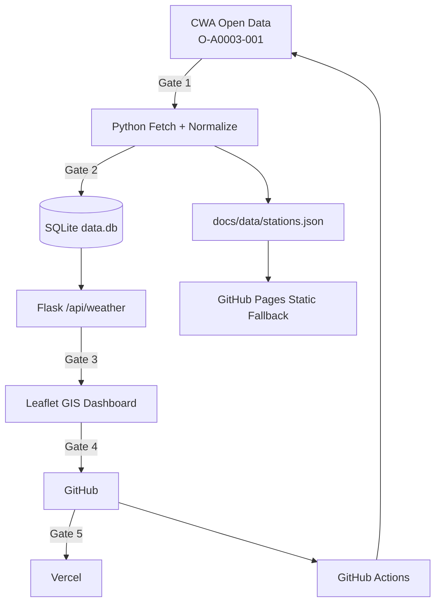

# AIoT-DA L3 HW1｜台灣即時氣象測站 GIS Dashboard

本專案為 AIoT-DA 第三課 Homework，依照課堂規劃的 **Five Gates** 完成一套從中央氣象署 Open Data、SQLite 資料庫、GIS 地圖、GitHub 到 Vercel 的完整資料應用流程。

- **GitHub：** https://github.com/prometheans152/0923
- **Vercel：** https://0923-site.vercel.app/
- **GitHub Pages：** https://prometheans152.github.io/0923/
- **CWA Dataset：** `O-A0003-001`（氣象觀測站－10分鐘綜觀氣象資料）

> Five Gates：**CWA API → SQLite → GIS Web App → GitHub → Vercel**

---

## 成果畫面


---

# 一、作業目的

本次作業的目的，是利用 AI Agent 協助完成一個較完整的資料應用專案，並將工作拆成可以逐關檢驗的流程，而不是只要求 AI 一次產生整個網站。

本作業完成以下目標：

1. 從中央氣象署 CWA Open Data API 實際取得 `O-A0003-001` 測站資料。
2. 將取得的資料清理、標準化後寫入 **SQLite**，並以 SQL Query 驗證資料確實存在。
3. 建立台灣 GIS 氣象地圖，讓前端從 SQLite-backed API 取得測站資料。
4. 將完整專案放到 GitHub，以 Git 做版本管理並以 GitHub Actions 自動測試、抓資料。
5. 將 Flask + GIS 專案部署至 Vercel，讓網站可由公開網址使用。
6. 透過 Five Gates 的方式管理 AI Coding 專案，使每一步都有明確 Output 與驗證方法。

---

# 二、系統架構



主要技術：

| 類別 | 使用技術 |
|---|---|
| 公開資料 | CWA Open Data API |
| 資料集 | O-A0003-001 |
| 資料處理 | Python |
| 資料庫 | SQLite |
| Web Backend | Flask |
| GIS | Leaflet |
| Frontend | HTML / CSS / Vanilla JavaScript |
| Basemap | MapTiler Streets v4 / Streets v4 Dark |
| Version Control | Git / GitHub |
| CI/CD | GitHub Actions + Vercel |
| Tests | pytest + Node syntax check |

---

# 三、開發步驟與結果：Five Gates

## Gate 1｜從中央氣象署取得真實資料

### 目的

第一關必須確認程式真的能從中央氣象署取得資料，而不是只有使用假資料或寫好 API 程式碼。

### 實作

程式使用 CWA Open Data：

```text
O-A0003-001
氣象觀測站－10分鐘綜觀氣象資料
```

由 `scripts/fetch_and_build.py`：

1. 從 Server-side Environment Variable 讀取 `CWA_API_KEY`。
2. 呼叫 CWA API。
3. 使用 `scripts/normalize.py` 清理資料。
4. 過濾 `-99`、`-999`、null 等無效值。
5. 統一測站欄位與座標格式。
6. 計算最高溫、最低溫、平均溫度等摘要資料。

API Key 不寫入 Repository，也不輸出到 Console。

### 實際驗證結果

2026-09-24 實際執行 CWA API Fetch：

```text
Mode: live_cwa_api
Observation time: 2026-09-24T16:40:00+08:00
Total stations: 362
Valid temperature stations: 350
Highest temperature: 32.6°C（環湖）
Lowest temperature: 8.0°C（玉山）
Average temperature: 27.6°C
```

產生的 `docs/data/stations.json` metadata 亦確認：

```text
build_mode = live_cwa_api
storage = sqlite
```

**Gate 1：PASS**

---

## Gate 2｜寫入 SQLite 並實際 Query

### 目的

第二關不是把資料直接顯示後就結束，而是要將取得的 CWA 資料存進 Database，並能夠再從 Database 查詢出資料。

本專案依課堂要求使用 **SQLite**。

### Database Schema

資料庫檔案：

```text
data.db
```

主要資料表：

```text
observations
snapshots
```

`observations` 保存：

- station_id
- station_name
- county / town
- latitude / longitude / altitude
- observation time
- temperature / humidity / pressure
- wind speed / wind direction / gust
- precipitation / UV
- weather
- temperature color/category
- source mode
- ingestion time

Primary Key 使用：

```text
(station_id, obs_time)
```

因此：

- 同一測站、同一時間重跑不會產生 Duplicate。
- 同一測站不同觀測時間可以累積成 Historical Data。

### 實際寫入結果

真實 CWA Fetch 後：

```text
SQLite upserted rows: 362
SQLite total observation rows: 362
SQLite latest observation: 2026-09-24T16:40:00+08:00
```

### SQL Query 驗證

以「新竹縣」為條件實際 Query SQLite，成功取得：

| 測站 | 鄉鎮 | 溫度 | 濕度 | 風速 |
|---|---|---:|---:|---:|
| 五峰站 | 五峰鄉 | 23.5°C | 86% | 0.3 m/s |
| 國一N077K | 湖口鄉 | 26.8°C | 78% | 3.5 m/s |
| 國一S082K | 湖口鄉 | 26.8°C | 79% | 3.6 m/s |

Flask 另外提供一個可直接驗證 Database 的 Endpoint：

```text
/api/db-check?county=新竹縣&limit=3
```

回傳內容包含：

```text
database = sqlite
row_count
latest_observation_time
sample rows
```

這代表資料不是從 README 或前端假造，而是真的重新從 SQLite Query 出來。

**Gate 2：PASS**

---

## Gate 3｜建立 GIS Web App，從 SQLite API 顯示資料

### 目的

第三關將 Database 裡的資料透過 Web API 提供給 GIS 地圖。

### 資料流程

Vercel / Flask 版本的主要流程：

```text
SQLite
   ↓
Flask /api/weather
   ↓
JavaScript fetch()
   ↓
Leaflet
   ↓
Taiwan GIS Map
```

前端 `docs/app.js` 會優先讀取：

```text
/api/weather
```

這個 API 的資料來源是 SQLite。

如果在 GitHub Pages 這類沒有 Flask Backend 的純靜態環境，才會 fallback 到：

```text
docs/data/stations.json
```

### GIS 功能

目前網站具備：

- 台灣置中 GIS 地圖。
- 362 個氣象測站。
- 氣溫數值 Marker。
- 點擊 Marker 顯示測站詳細資料。
- 測站搜尋。
- 縣市篩選。
- 氣溫範圍篩選。
- 測站摘要統計。
- 手動 / 自動 Refresh。
- 深色與淺色 MapTiler Basemap。
- 7 段 Temperature Legend。

主要色階符合課堂要求：

| 溫度 | 顏色 |
|---|---|
| < 10°C | 藍 |
| 10–15°C | 青 |
| 15–20°C | 綠 |
| 20–25°C | 黃 |
| 25–30°C | 橘 |
| 30–35°C | 紅 |
| > 35°C | 深紅 |

### Local API 驗證

Flask Test Client：

```text
GET /                         200
GET /app.js                   200
GET /api/weather              200
GET /api/db-check             200
/api/weather stations         362
/api/db-check database        sqlite
/api/db-check row_count       362
```

JavaScript Syntax：

```text
node --check docs/app.js
PASS
```

**Gate 3：PASS**

---

## Gate 4｜GitHub 版本管理與自動化

Repository：

https://github.com/prometheans152/0923

GitHub 保存：

- Frontend。
- Flask Server。
- SQLite schema / database logic。
- CWA data pipeline。
- Tests。
- Vercel configuration。
- Homework README。

GitHub Actions 會：

```text
checkout
  ↓
install Python dependencies
  ↓
pytest
  ↓
use GitHub Secret CWA_API_KEY
  ↓
fetch live O-A0003-001
  ↓
normalize
  ↓
write SQLite + JSON artifact
  ↓
deploy GitHub Pages
```

`CWA_API_KEY` 已設定為 GitHub Actions Repository Secret，不會寫在公開 Source Code。

**Gate 4：PASS**

---

## Gate 5｜部署至 Vercel

Production：

https://0923-site.vercel.app/

Vercel Python Serverless 架構：

```text
Vercel
  ↓
vercel.json
  ↓
@vercel/python
  ↓
api/index.py
  ↓
server.py (Flask)
  ↓
SQLite
  ├─ /api/weather
  └─ /api/db-check
```

Vercel 專案中亦使用 Secret Environment Variable：

```text
CWA_API_KEY
```

而不是把 CWA credential 寫在前端。

Vercel 與 GitHub Repository 相連，因此 main branch 更新後會觸發新的 Production Deployment。

正式部署後驗證：

```text
GET /                                      200
GET /app.js                                200
GET /api/weather                           200
GET /api/db-check?county=新竹縣&limit=3    200

/api/weather:
storage = sqlite
build_mode = live_cwa_api
stations = 362
latest observation = 2026-09-24T16:50:00+08:00

/api/db-check:
database = sqlite
row_count = 724
sample rows = 3
```

Vercel runtime 中出現 724 筆 observations，是因為 SQLite 已包含上一個 snapshot，再成功寫入新的 362 站 snapshot，證明資料表可以保留不同 observation time，而不是每次更新直接覆蓋成單一 JSON。

**Gate 5：PASS**

---

# 四、功能成果

## 1. 即時 CWA Data Pipeline

資料不是只有預先放好的 Demo JSON；已實際驗證可以從 CWA O-A0003-001 取得最新測站資料，並將 `build_mode` 標示為 `live_cwa_api`。

## 2. SQLite 歷史資料設計

SQLite 不是單純 Cache，而是以 `station_id + obs_time` 為 Key，因此可保存同一測站的多個 Observation Time。

這也讓未來增加：

- 24 小時溫度趨勢。
- 一週歷史曲線。
- 測站時間序列。
- 區域統計。

時，不需要重新設計資料格式。

## 3. GIS 氣象視覺化

透過顏色和 Marker 直接呈現空間與溫度差異，比單純 Table 更容易看到：

- 山區低溫。
- 西部平原高溫。
- 各縣市測站密度。
- 離島測站。

## 4. 深色 / 淺色地圖

```text
🌙 Dark → MapTiler streets-v4-dark
☀️ Light → MapTiler streets-v4
```

---

# 五、測試與驗證

| 驗證項目 | 結果 |
|---|---|
| CWA O-A0003-001 真實 Fetch | PASS |
| Production Data mode | `live_cwa_api` |
| Production observation time | **2026-09-24 16:50 +08:00** |
| CWA stations | 362 |
| SQLite Local Gate 2 寫入 | 362 rows |
| SQLite Production runtime observations | **724 rows** |
| SQLite Query 新竹縣 | PASS（3 samples） |
| SQLite Duplicate Prevention | PASS |
| SQLite Multiple Observation Times | PASS |
| `node --check docs/app.js` | PASS |
| pytest | **18 / 18 PASS** |
| Production `/` | HTTP 200 |
| Production `/app.js` | HTTP 200 |
| Production `/api/weather` | HTTP 200 |
| Production `/api/db-check` | HTTP 200 |
| Production GIS API storage | `sqlite` |
| GitHub Actions | **SUCCESS / live_cwa_api** |
| Vercel Production | **Ready** |

---

# 六、問題與解決

## 1. 一開始錯把 JSON 當作 Gate 2

初版只將 Normalize 後的資料寫入 `stations.json`。

這雖然足以讓 GIS 運作，但不符合本次 Five Gates 中「資料寫入 Database 並 Query 驗證」的要求。

### 修正

新增：

```text
scripts/database.py
data.db
```

現在流程為：

```text
CWA API
  ↓
Normalize
  ↓
SQLite
  ↓
SQL Query
  ↓
Flask API
  ↓
GIS
```

`stations.json` 現在只作為 GitHub Pages / Static fallback，而不是拿來取代 Gate 2。

---

## 2. MapTiler 出現 API KEY REQUIRED

初期地圖來源沒有使用有效 MapTiler Browser Key，因此 Tile 出現 `API KEY REQUIRED`。

### 修正

使用正確的 MapTiler Browser API Key，並以 Allowed HTTP Origins 限制使用來源。

---

## 3. 淺色地圖 Style ID 錯誤

初版使用不存在的：

```text
streets-v4-light
```

修正為：

```text
Light = streets-v4
Dark  = streets-v4-dark
```

---

## 4. Vercel 一開始以純 Static 方式部署

如果 Vercel Root Directory 直接指向 `docs/`，就無法執行 Flask、SQLite 與 Python Serverless。

### 修正

Vercel 使用 Repository Root，並透過：

```text
vercel.json
api/index.py
server.py
```

建立 Python Serverless Function。

---

# 七、討論與心得

## 1. Five Gates 比「直接叫 AI 寫完」更重要

這次最重要的不是 AI 能不能快速寫出地圖，而是每一關都必須有可驗證的 Output：

```text
Gate 1：真的從 CWA 拿到資料了嗎？
Gate 2：真的寫進 SQLite，而且 Query 得出來嗎？
Gate 3：地圖真的讀 Database API 嗎？
Gate 4：Source、Tests 與 Secret 管理都有進 GitHub 嗎？
Gate 5：Vercel 上的正式網站和 API 真的可以用嗎？
```

如果其中一關失敗，就可以直接在該 Gate Debug，不需要從整個專案重新找問題。

## 2. SQLite 在 Local 與 Serverless 的差異

Local 的 `data.db` 是真正寫在本機 Disk，因此程式重新啟動後資料仍存在。

但是 Vercel Serverless 不適合把 Function 本機 Disk 當作永久資料庫。本專案在 Vercel 使用可寫入的 `/tmp` SQLite：

1. Instance 啟動時 Seed SQLite。
2. 如果存在 `CWA_API_KEY`，從 CWA Refresh。
3. GIS 由這個 SQLite 提供資料。

這符合本次作業「CWA → Database → GIS」的流程，但 **Vercel Instance 被回收或重新建立後，`/tmp` 內的歷史資料不保證永久存在**。

如果 Final Project 要真正長期保存一年甚至更久的 Historical Data，下一步應使用外部 Persistent Database，例如：

- Supabase / PostgreSQL
- Neon PostgreSQL
- 其他 Managed Database

也就是：

```text
目前 Homework：
CWA → SQLite → GIS

長期 Production：
CWA → Persistent Cloud DB → GIS
```

## 3. Secret 與 Browser Key 要分清楚

本專案有兩種類型的 Key：

**CWA API Key**
- Server-side Secret。
- 放在 GitHub Secret / Vercel Environment Variable。
- 不進 Git Repository。

**MapTiler Browser API Key**
- Browser 本來就能從 Request 看到。
- 使用 Allowed HTTP Origins 限制來源。

兩者的安全模型並不相同。

---

# 八、結論

本次 Homework 已依照 Five Gates 完成：

```text
Gate 1
CWA O-A0003-001
        ↓
Gate 2
SQLite Database + SQL Query
        ↓
Gate 3
Flask API + Leaflet GIS
        ↓
Gate 4
GitHub + Tests + GitHub Actions
        ↓
Gate 5
Vercel Python Serverless
```

實際驗證結果：

```text
Live CWA stations          362
Local Gate 2 SQLite rows    362
Vercel SQLite runtime rows  724
Latest observation         2026-09-24 16:50 +08:00
pytest                     18/18 PASS
JavaScript syntax          PASS
GitHub Actions             SUCCESS
Vercel GIS/API endpoints   PASS
```

這次除了完成氣象地圖，也實際走過資料取得、資料庫持久化、SQL Query、GIS、版本管理、測試與 Cloud Deployment 的完整流程。

---

# 專案結構

```text
week3-cwa-station-map/
├── .github/
│   └── workflows/
│       └── update-and-deploy.yml
├── api/
│   └── index.py
├── docs/
│   ├── index.html
│   ├── style.css
│   ├── app.js
│   ├── report-dashboard.png
│   └── data/
│       ├── stations.json
│       └── stations_fixture.json
├── scripts/
│   ├── database.py
│   ├── fetch_and_build.py
│   └── normalize.py
├── tests/
│   ├── test_color_scale.py
│   ├── test_database.py
│   ├── test_normalize.py
│   └── test_schema.py
├── data.db
├── server.py
├── vercel.json
├── requirements.txt
└── README.md
```

# 本機執行

安裝：

```bash
pip install -r requirements.txt
```

執行 CWA → SQLite：

```bash
# 先以環境變數安全提供 CWA_API_KEY
python scripts/fetch_and_build.py
```

測試：

```bash
pytest -v
node --check docs/app.js
```

啟動 Flask：

```bash
python server.py
```

瀏覽：

```text
http://127.0.0.1:5000/
http://127.0.0.1:5000/api/weather
http://127.0.0.1:5000/api/db-check?county=新竹縣&limit=3
```
