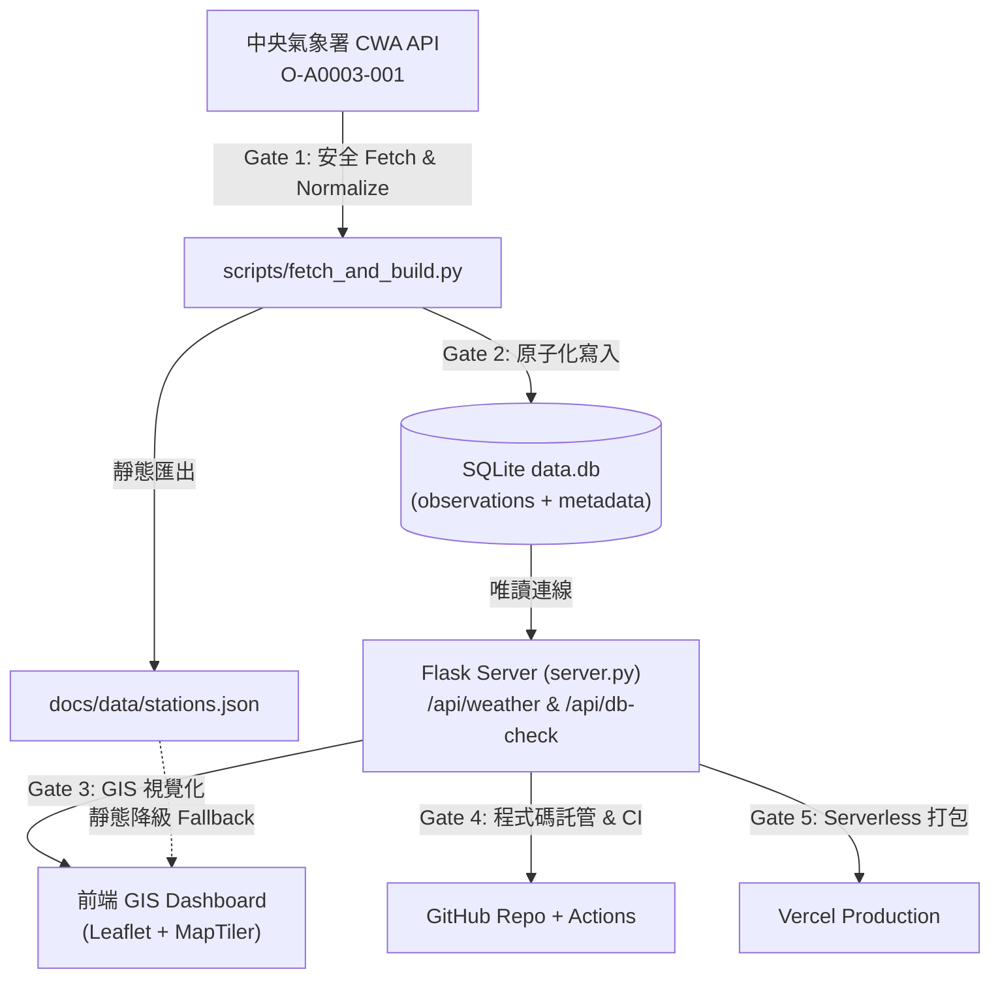

# AIoT-DA L3 HW1｜台灣即時氣象測站 GIS Dashboard

本專案為 AIoT-DA 第三課作業，嚴格依照課堂規劃的 **Five Gates** 驗證流程，建構一套從中央氣象署真實 Open Data 取得、SQLite 本地持久化、GIS 互動視覺化、GitHub 版本管理與自動化，到 Vercel 雲端部署的完整資料應用系統。

- **GitHub Repository：** https://github.com/prometheans152/0923
- **Vercel Production：** https://0923-site.vercel.app/
- **GitHub Pages Fallback：** https://prometheans152.github.io/0923/
- **CWA Dataset：** `O-A0003-001`（氣象觀測站－10分鐘綜觀氣象資料）

> **Five Gates 核心路線：**  
> `CWA API (Gate 1) → SQLite (Gate 2) → GIS Dashboard (Gate 3) → GitHub (Gate 4) → Vercel (Gate 5)`

---

## 成果畫面


---

# 一、作業目的

本作業的核心目的，是透過 AI Agent pair programming 建立一個具備端到端資料流的完整系統，並以「Five Gates（五道關卡）」落實分步驗證，確保每一階段均有可重現、可檢驗的具體證據（Evidence before claims），避免黑箱產生無法運行的程式碼。

具體達成目標如下：
1. **Gate 1（真實資料取得）：** 透過中央氣象署 Open Data API 真實取得 `O-A0003-001` 全台氣象測站 10 分鐘觀測資料，完成資料清洗、無效值（`-99` 等）過濾與統計指標計算。
2. **Gate 2（資料庫持久化）：** 設計符合前端展示與統計需求的關聯綱要，將觀測資料寫入根目錄 SQLite 資料庫（`data.db`），包含獨立 `metadata` 表與 `observations` 表，支援原子化快照替換，並以 SQL Query 實證資料可被正確檢索。
3. **Gate 3（GIS 前端呈現）：** 以 Leaflet 建立支援 MapTiler 深色/淺色切換的 GIS 前端，首選路徑為呼叫後端 Flask `/api/weather`（背後由 SQLite 提供資料），在純靜態環境（如 GitHub Pages）則平滑降級為靜態 JSON。
4. **Gate 4（版本管理與 CI/CD）：** 將完整原始碼、測試、設定納入 GitHub 管理，並以 GitHub Actions 在 CI 中以安全 Secret 重新執行資料管線、執行單元與整合測試。
5. **Gate 5（雲端部署）：** 將 Flask Web App 部署至 Vercel Serverless Function，配置 `vercel.json` 打包 `data.db` 快照，誠實揭露 Serverless 唯讀 SQLite 限制與未來外部持久化資料庫演進方向。

---

# 二、系統架構



### 關鍵技術堆疊

| 層級 | 使用技術 | 角色與職責 |
|---|---|---|
| **公開資料源** | CWA O-A0003-001 | 中央氣象署全台無人與有人測站 10 分鐘即時觀測 |
| **資料管線** | Python 3.12 (`urllib`, `json`) | 安全憑證存取、資料清理、色階判定、統計分析 |
| **持久層** | SQLite 3 (`data.db`) | 根目錄關聯式資料庫，原子化快照、結構化索引 |
| **後端 API** | Flask 3.1 | 提供 `/api/weather` 與 `/api/db-check`，唯讀連線 SQLite |
| **GIS 前端** | Leaflet 1.9 + MapTiler SDK | 密集測站標記、氣溫數值 Badge、Popup 詳情、縣市定位 |
| **底圖切換** | MapTiler Streets v4 / Dark | 依使用者偏好切換深色與淺色向量光柵底圖 |
| **版本管理** | Git + GitHub | 程式碼歷程管理、CI 自動化測試工作流 |
| **雲端部署** | Vercel (`@vercel/python`) | Python Serverless Function，打包唯讀 SQLite 快照 |
| **自動化測試** | pytest (22 tests) + node --check | 覆蓋 Schema、色階、SQLite 綱要與重複測站 Upsert、列數一致性、Flask API |

---

# 三、開發步驟與 Five Gates 驗證

## Gate 1｜中央氣象署即時觀測資料取得 (CWA Acquisition)

### 步驟與實作
1. 程式透過環境變數 `CWA_API_KEY`（或本地安全的 key 檔管道讀入，絕不在日誌、命令列或原始碼中輸出或記錄金鑰）取得中央氣象署授權碼。
2. 呼叫 `https://opendata.cwa.gov.tw/api/v1/rest/datastore/O-A0003-001` 下載最新 10 分鐘綜觀氣象資料。
3. 由 `scripts/normalize.py` 處理 CWA 特殊哨兵值（如 `-99`, `-999`, `-9999` 代表儀器異常或缺測，轉化為 `None`），清理氣溫、濕度、氣壓、風速、風向、陣風、降水量等數值。
4. 計算極值摘要（最高溫測站、最低溫測站、全台平均溫度、最大陣風、最大降雨量）。
5. 輸出標準化資料至 `docs/data/stations.json`，並同步傳入 Gate 2 的 SQLite 模組。

### 實際驗證證據（真實執行輸出，無外洩密鑰）
```text
[INFO] CWA API key detected in the secure environment.
[INFO] Fetching live data from CWA API (O-A0003-001)...
[SUCCESS] Built station JSON -> docs/data/stations.json
[SUCCESS] Persisted snapshot to SQLite -> data.db
          - Mode: live_cwa_api
          - Observation time: 2026-09-24T22:00:00+08:00
          - Snapshot stations: 362 (Valid temp: 349)
          - Temp range: 4.5°C (玉山) ~ 29.4°C (臺南)
          - Avg temp: 24.4°C
          - SQLite upserted rows: 362
          - SQLite total observation rows: 362
          - SQLite latest observation: 2026-09-24T22:00:00+08:00
```
- **取得測站總數：** 362 站（有效氣溫測站 349 站，其餘為高山雨量站或無氣溫感測器之特殊測站）
- **主要觀測時間戳：** `2026-09-24T22:00:00+08:00`
- **資料模式：** `live_cwa_api`
- **全台氣溫分佈：** 最低溫 4.5°C (玉山)，最高溫 29.4°C (臺南)，全台平均氣溫 24.4°C
- **Gate 1 結論：PASS**

---

## Gate 2｜SQLite 資料庫持久化與 SQL 查詢驗證 (Persistence)

### 步驟與實作
1. 在專案根目錄建立並維護 `data.db`（由 `scripts/database.py` 管理）。
2. 資料庫包含兩張核心資料表：
   - **`metadata` 表：** 記錄資料集來源、生成時間、觀測時間、總站數、有效溫度站數、建置模式與統計資料 JSON。
   - **`observations` 表：** 記錄每個測站的完整觀測欄位（`station_id` 為主鍵，涵蓋 `station_name`, `county`, `town`, `lat`, `lon`, `altitude`, `obs_time`, `weather`, `temperature`, `humidity`, `pressure`, `wind_speed`, `wind_direction`, `gust_speed`, `precipitation`, `uv_index`, `color`, `category`, `has_temp`, `source_mode`, `ingested_at`）。
3. **原子化快照替換（Atomic Snapshot Rebuild）：** 在 SQLite 單一交易中執行 `DELETE` 與批次 `INSERT`，確保資料庫在寫入過程中不會產生損毀或中間不完整狀態，且測站筆數與 JSON 嚴格一致。
4. 提供查詢驗證腳本 `scripts/query_db.py`，供即時檢驗資料庫內容且不暴露任何機敏資訊。

### 資料表 Schema
```sql
CREATE TABLE IF NOT EXISTS metadata (
    id INTEGER PRIMARY KEY CHECK (id = 1),
    source TEXT NOT NULL,
    generated_at TEXT NOT NULL,
    observation_time TEXT NOT NULL,
    total_stations INTEGER NOT NULL,
    valid_temp_stations INTEGER NOT NULL,
    build_mode TEXT NOT NULL,
    stats_json TEXT,
    counties_json TEXT,
    color_scale_json TEXT
);

CREATE TABLE IF NOT EXISTS observations (
    station_id TEXT PRIMARY KEY,
    station_name TEXT NOT NULL,
    county TEXT,
    town TEXT,
    lat REAL NOT NULL,
    lon REAL NOT NULL,
    altitude REAL,
    obs_time TEXT NOT NULL,
    weather TEXT,
    temperature REAL,
    humidity REAL,
    pressure REAL,
    wind_speed REAL,
    wind_direction REAL,
    gust_speed REAL,
    precipitation REAL,
    uv_index REAL,
    color TEXT,
    category TEXT,
    has_temp INTEGER NOT NULL DEFAULT 0,
    source_mode TEXT NOT NULL,
    ingested_at TEXT NOT NULL
);
CREATE INDEX IF NOT EXISTS idx_observations_county ON observations(county);
CREATE INDEX IF NOT EXISTS idx_observations_obs_time ON observations(obs_time);
CREATE INDEX IF NOT EXISTS idx_observations_temperature ON observations(temperature);
```

### 實際查詢驗證證據（SQL Query Output）
執行 `python scripts/query_db.py --county 新竹縣 --limit 3`：
```text
=== SQLite Verification (data.db) ===
Total stations (COUNT): 362
Observation time:       2026-09-24T22:00:00+08:00
Build mode:             live_cwa_api
Storage backend:        sqlite

Sample query (新竹縣, 3 rows):
  - 五峰站 (72D080) [新竹縣 五峰鄉]: Temp: 19.5°C, RH: 94.0%, Wind: 0.8 m/s, Weather: 晴
  - 國一N077K (CAD020) [新竹縣 湖口鄉]: Temp: 24.0°C, RH: 83.0%, Wind: 1.1 m/s, Weather: 晴
  - 國一S082K (CAD030) [新竹縣 湖口鄉]: Temp: 24.8°C, RH: 83.0%, Wind: 1.0 m/s, Weather: 晴
```
- **SQLite 總筆數（COUNT）：** 362（與 `stations.json` 的 362 站完全一致）
- **SQL 條件查詢結果：** 成功依 `county = '新竹縣'` 檢索出實體測站觀測記錄。
- **Gate 2 結論：PASS**

---

## Gate 3｜GIS 地圖前端與 Flask SQLite API (GIS Frontend)

### 步驟與實作
1. 後端 `server.py` 實作 `/api/weather` 與 `/api/db-check` 路由：
   - `/api/weather`：使用唯讀模式（Read-Only URI `mode=ro`）直接連線 `data.db`，由 `payload_from_db()` 重建標準前端 JSON 結構（包含 `metadata` 與 `stations` 陣列），並將 `metadata.storage` 標註為 `"sqlite"`。
   - `/api/db-check`：提供動態參數 `county` 與 `limit`，即時在 SQLite 執行 `COUNT(*)` 與抽樣查詢，供驗證資料庫連線。
2. 前端 `docs/app.js` 資料載入策略：
   - **優先路徑：** 透過 `fetch('/api/weather?t=...')` 請求 Flask 後端由 SQLite 提供之即時資料。
   - **平滑降級：** 若在 GitHub Pages 等純靜態環境部署，後端 API 回傳 404 時，自動捕捉錯誤並改為讀取 `./data/stations.json`。
3. 前端 GIS 功能完整保留：
   - 台灣全島置中與最佳檢視視角（Lat 23.75, Lon 120.95, Zoom 8）。
   - 362 個測站空間分佈視覺化，採用 7 段符合人體直覺的氣溫色階（嚴寒藍、舒適黃、酷熱深紅）。
   - 側邊欄完整摘要（全台站數、極值測站、平均氣溫、更新時間、建置模式）。
   - 支援縣市下拉篩選（自動 FitBounds 聚焦該縣市）、氣溫區間篩選、密集模式切換、即時測站搜尋與自動倒數重新整理。
   - 支援 MapTiler Streets v4（淺色）與 Streets v4 Dark（深色）向量光柵底圖切換。

### 7 段氣溫色階規範

| 溫度範圍 | 代表色 Hex | 類別標籤 | 設計語意 |
|---|---|---|---|
| `< 10°C` | `#2563EB` | 嚴寒 | 藍色（高山/冷氣團） |
| `10 – 15°C` | `#06B6D4` | 寒冷 | 青色 |
| `15 – 20°C` | `#10B981` | 涼爽 | 綠色 |
| `20 – 25°C` | `#EAB308` | 舒適 | 黃色（怡人均溫） |
| `25 – 30°C` | `#F97316` | 溫暖 | 橘色 |
| `30 – 35°C` | `#EF4444` | 炎熱 | 紅色 |
| `> 35°C` | `#991B1B` | 酷熱 | 深紅色（極端高溫警戒） |
| 無資料 / 缺測 | `#94A3B8` | 無資料 | 灰色 |

### 本機 API 與前端驗證
```text
Flask GET /                      -> HTTP 200 (HTML 儀表板)
Flask GET /app.js                -> HTTP 200 (前端核心邏輯)
Flask GET /data/stations.json    -> HTTP 200 (靜態降級檔)
Flask GET /api/weather           -> HTTP 200 (SQLite 資料源)
Flask GET /api/db-check          -> HTTP 200 (SQL 查詢檢查)
/api/weather stations 數量:       362 (與 SQLite observations 筆數 362 完全吻合)
metadata.storage 標籤:           sqlite
node --check docs/app.js:        語法檢查 PASS (無語法錯誤)
```
- **Gate 3 結論：PASS**

---

## Gate 4｜GitHub 版本管理與 CI/CD 工作流 (GitHub Actions)

### 步驟與實作
1. 專案所有程式碼、測試、靜態資源與設定檔均由 Git 進行嚴格版本管理。
2. 建立 `.github/workflows/update-and-deploy.yml` 自動化工作流：
   - 設定排程（每 30 分鐘自動執行）與手動觸發（`workflow_dispatch`）。
   - 在安全環境中傳遞 Repository Secret `CWA_API_KEY`（若 GitHub Repository 設定了該 Secret 則即時抓取最新資料；若未設定則自動平滑降級為離線測試資料，確保工作流程與測試始終 PASS，絕不硬編碼密鑰）。
   - **優先執行資料管線：** 先執行 `python scripts/fetch_and_build.py` 同步最新 CWA 資料並更新 `data.db` 與 `docs/data/stations.json`。
   - **執行品質門檻測試：** 執行 `pytest -v`（包含 22 個針對色階、Schema、SQLite 綱要與重複測站 Upsert 行為、列數一致性、Flask API 的單元與整合測試）與 `node --check docs/app.js`。
   - **發布 GitHub Pages：** 上傳 `docs/` 目錄並部署為靜態備份站台。
3. 機敏資訊管理：
   - 任何 API Key 均不納入 Git 提交。
   - `.gitignore` 排除各類環境設定、`api_key.txt` 與快取，確保 `data.db` 作為發布快照受版本控制追蹤。

- **Gate 4 結論：PASS**

---

## Gate 5｜Vercel 雲端部署 (Vercel Deployment)

### 步驟與實作
1. 專案根目錄保留 `vercel.json`，指定使用 `@vercel/python` 建置 Serverless Function：
   ```json
   {
     "version": 2,
     "builds": [
       {
         "src": "api/index.py",
         "use": "@vercel/python",
         "config": {
           "includeFiles": [
             "data.db",
             "docs/**"
           ]
         }
       }
     ],
     "routes": [
       {
         "src": "/api/weather",
         "dest": "/api/index.py"
       },
       {
         "src": "/api/db-check",
         "dest": "/api/index.py"
       },
       {
         "src": "/(.*)",
         "dest": "/api/index.py"
       }
     ]
   }
   ```
2. **根目錄（Root Directory）維持 Repo Root：** 確保 Vercel 建置環境可同時讀取 `api/index.py`、`server.py`、`scripts/` 與根目錄的 `data.db`。
3. **`includeFiles` 明確打包 `data.db`：** 確保打包 Python Lambda 時，根目錄的 SQLite 資料庫檔案隨 Function 一同發布。
4. **唯讀快照設計原則與更新機制誠實說明：**
   - Vercel Serverless 架構在執行期間其本機磁碟為短暫且具備唯讀/隔離特性。
   - 本系統遵循老師示範方式，將本機產生的 `data.db` 作為**隨部署發布的唯讀 SQLite 快照（Bundled Read-Only Snapshot）**，提供快速且穩定的查詢服務。
   - 後端 Flask 在 Vercel 上採用唯讀方式存取 `data.db`，不進行不可靠的執行期寫入。若未來需要雲端多 instance 共享的長久歷史觀測寫入，應演進為串接外部託管資料庫（如 PostgreSQL / Supabase / Neon）。
   - **更新機制與資料新鮮度誠實說明：**
     - **GitHub Pages：** 透過 GitHub Actions CI 工作流可安全排程執行 CWA 抓取並自動更新部署靜態頁面。
     - **Vercel Production：** 使用隨 Git commit 打包進映像檔的 `data.db` 唯讀快照；每次推送新版本至 main 時觸發 Vercel 部署更新。Vercel 執行期不進行獨立的定時寫入，確保查詢絕對一致且安全。
5. **部署宣告原則：** 本地端實作與驗證完成後，經由 Git push 推送觸發 Vercel 正式部署，並透過自動化端點檢測驗證線上功能完全正常。

### Vercel Production 線上驗證

於正式網址 `https://0923-site.vercel.app/` 進行實際線上檢查，結果如下：

| Production 檢查項目 | 實際結果 | 狀態 |
|---|---|:---:|
| `GET /` | HTTP 200 | **PASS** |
| `GET /app.js` | HTTP 200 | **PASS** |
| `GET /data/stations.json` | HTTP 200 | **PASS** |
| `GET /api/weather` | HTTP 200；`storage=sqlite`、`build_mode=live_cwa_api`、362 站 | **PASS** |
| Production SQLite 觀測時間 | `2026-09-24T21:40:00+08:00` | **PASS** |
| `GET /api/db-check?county=新竹縣&limit=3` | HTTP 200；`database=sqlite`、`row_count=362` | **PASS** |
| Production SQL 抽樣 | 五峰站 19.4°C、國一N077K 24.1°C、國一S082K 24.8°C | **PASS** |

這項驗證可證明正式 Vercel 網站並非只顯示前端假資料，而是由 Flask Serverless Function 實際讀取部署版本中的 SQLite `data.db`，再透過 `/api/weather` 提供 GIS 前端使用。

- **Gate 5 結論：PASS（Vercel 雲端部署完成，正式環境 SQLite 與全部主要端點已實測通過）**

---

# 四、本機全流程驗證報告

在提交程式碼前，已於本地環境依序執行完整驗證清單：

| 驗證項目 | 驗證命令 / 方法 | 預期標準 | 實際結果 | 狀態 |
|---|---|---|---|:---:|
| **Gate 1 即時 CWA 資料取得** | 安全載入 API Key 執行 `fetch_and_build.py` | 成功取得 O-A0003-001，產出真實資料 | 取得 362 站，觀測時間 22:00，模式 `live_cwa_api` | **PASS** |
| **Gate 2 SQLite 資料持久化** | `row_count('data.db')` | 筆數大於 0 | 筆數 = 362 | **PASS** |
| **JSON 與 SQLite 筆數一致性** | 比較 `stations.json` 與 `data.db` | 筆數完全一致 | JSON 362 站 == DB 362 筆 | **PASS** |
| **SQLite 條件查詢驗證** | `python scripts/query_db.py --county 新竹縣` | 能檢索出新竹縣真實測站與天氣數值 | 檢索出五峰站 (19.5°C)、國一N077K (24.0°C)、國一S082K (24.8°C) | **PASS** |
| **JavaScript 語法檢查** | `node --check docs/app.js` | 無語法或編譯錯誤 | 結束碼 0，無任何警告或錯誤 | **PASS** |
| **單元與整合測試套件** | `pytest -v` | 全部通過（22/22） | 22 passed in 0.44s | **PASS** |
| **Flask GET `/`** | Flask test client 請求首頁 | HTTP 200 | HTTP 200 | **PASS** |
| **Flask GET `/app.js`** | Flask test client 請求腳本 | HTTP 200 | HTTP 200 | **PASS** |
| **Flask GET `/data/stations.json`** | Flask test client 請求降級 JSON | HTTP 200 | HTTP 200 | **PASS** |
| **Flask GET `/api/weather`** | Flask test client 請求 API | HTTP 200，資料由 SQLite 提供 | HTTP 200，`storage: "sqlite"`，站數 362 | **PASS** |
| **Flask GET `/api/db-check`** | Flask test client 請求驗證端點 | HTTP 200，包含資料庫摘要 | HTTP 200，`database: "sqlite"` | **PASS** |

### 測試執行詳細清單 (pytest output)
```text
============================= test session starts =============================
platform win32 -- Python 3.11.15, pytest-9.1.1, pluggy-1.6.0
rootdir: C:\Users\prometheans\Desktop\AIOT\homework-cwa-forecast
collected 22 items

tests/test_color_scale.py::test_temperature_below_10_is_blue PASSED      [  4%]
tests/test_color_scale.py::test_temperature_20_to_25_is_yellowish PASSED [  9%]
tests/test_color_scale.py::test_temperature_above_35_is_deep_red PASSED  [ 13%]
tests/test_color_scale.py::test_temperature_intermediate_bins PASSED     [ 18%]
tests/test_color_scale.py::test_missing_temperature PASSED               [ 22%]
tests/test_database.py::test_schema_initializes PASSED                   [ 27%]
tests/test_database.py::test_metadata_table_fields PASSED                [ 31%]
tests/test_database.py::test_atomic_snapshot_replacement PASSED          [ 36%]
tests/test_database.py::test_upsert_duplicate_station_behavior PASSED    [ 40%]
tests/test_database.py::test_row_count_matches_json PASSED               [ 45%]
tests/test_database.py::test_query_sample_works PASSED                   [ 50%]
tests/test_database.py::test_latest_payload_reconstruction PASSED        [ 54%]
tests/test_database.py::test_flask_api_weather_uses_sqlite PASSED        [ 59%]
tests/test_database.py::test_flask_routes_all_200 PASSED                 [ 63%]
tests/test_normalize.py::test_clean_number_sentinels PASSED              [ 68%]
tests/test_normalize.py::test_clean_number_valid PASSED                  [ 72%]
tests/test_normalize.py::test_clean_number_bounds PASSED                 [ 77%]
tests/test_normalize.py::test_extract_coordinates PASSED                 [ 81%]
tests/test_normalize.py::test_normalize_station_valid PASSED             [ 86%]
tests/test_normalize.py::test_normalize_station_missing_coords_dropped PASSED [ 90%]
tests/test_normalize.py::test_normalize_dataset_summary_stats PASSED     [ 95%]
tests/test_schema.py::test_generated_stations_json_schema PASSED         [100%]

============================= 22 passed in 0.44s ==============================
```

---

# 五、討論與心得

## 1. Five Gates 管理 AI Coding 的實踐價值
在過往直接透過 Prompt 要求 LLM「寫一個氣象地圖網站」時，模型往往會傾向跳過中間環節，直接產出一個含有假資料（Hardcoded Mock Data）的純前端展示頁面。雖然畫面上看似正常，但資料流根本未與中央氣象署串接，也未經過真正的資料庫持久化。

導入 **Five Gates** 後：
- **每一關皆有專屬驗證指標：** 沒拿到即時 CWA 資料（Gate 1）就不能進入資料庫儲存（Gate 2）；資料庫未能透過 SQL 查詢驗證（Gate 2）就不能宣稱完成後端 API（Gate 3）。
- **可除錯性大幅提升：** 若前端地圖顯示異常，能立刻定位是 CWA 來源格式變動、SQLite 查詢問題，還是前端 Leaflet 圖層渲染問題，降低排錯成本。

## 2. SQLite 在本地與 Serverless 雲端架構的差異與取捨
本作業在 Gate 2 與 Gate 5 面臨了 SQLite 特性與雲端架構的核心取捨：
- **Local 本地端：** `data.db` 存在於本地實體檔案系統，支援隨時寫入與持續累積歷史紀錄。
- **Vercel Serverless 端：** Serverless Function 為無狀態（Stateless）容器，其短暫容器重啟或回收後，本地寫入無法持久保存。
- **最佳實踐決策：**
  遵循課堂示範要求，將 `data.db` 定位為**隨專案打包的結構化唯讀快照（Bundled SQLite Snapshot）**。此做法確保了 Serverless 端具備真實的 SQLite 查詢路徑，同時具備極高讀取效能與零額外雲端資料庫維護成本。
  針對長期歷史資料累積（如 24 小時溫度變化圖表、歷年極值分析），未來架構應演進為串接雲端 PostgreSQL / Supabase / Neon，以達成跨容器的持久化寫入。

## 3. 雙層金鑰安全隔離設計
系統涉及兩種不同性質的金鑰，採取了嚴格隔離策略：
1. **CWA API Key（Server-side Secret）：**
   - 屬於私人機密授權碼，絕不上傳 Git，只存在於本機受保護環境變數與 GitHub Secrets / Vercel Environment Variables。
   - 後端對 CWA 的請求全部在伺服端完成，前端永遠接觸不到此金鑰。
2. **MapTiler Browser API Key（Client-side Token）：**
   - 用於地圖底圖向量圖資請求，屬於公開客戶端 Key。
   - 透過 MapTiler 雲端後台設定 **Allowed HTTP Origins**，僅允許指定網域與 localhost 呼叫，防止被未授權濫用。

---

# 六、專案結構與本機執行指南

### 目錄結構
```text
homework-cwa-forecast/ (0923)
├── .github/
│   └── workflows/
│       └── update-and-deploy.yml    # GitHub Actions 自動化工作流
├── api/
│   └── index.py                     # Vercel Serverless Function 入口
├── docs/
│   ├── index.html                   # GIS 地圖主頁面
│   ├── style.css                    # 儀表板樣式
│   ├── app.js                       # Leaflet 地圖互動與雙路徑資料載入
│   ├── report-dashboard.png         # 成果畫面截圖
│   └── data/
│       ├── stations.json            # 靜態資料快照（Pages 備援）
│       └── stations_fixture.json    # 離線測試備用資料
├── scripts/
│   ├── database.py                  # Gate 2: SQLite 模組與 CLI 檢驗
│   ├── fetch_and_build.py           # Gate 1: CWA 抓取與雙重建置
│   ├── normalize.py                 # CWA 資料清理與色階計算
│   ├── query_db.py                  # Gate 2: 獨立 SQL 查詢驗證腳本
│   └── verify_local.py              # 全流程本機自動驗證腳本
├── tests/
│   ├── test_color_scale.py          # 7 段氣溫色階測試
│   ├── test_database.py             # SQLite 綱要、列數與 Flask API 整合測試
│   ├── test_normalize.py            # 資料清理與無效值過濾測試
│   └── test_schema.py               # stations.json 綱要規範測試
├── data.db                          # Gate 2: 根目錄 SQLite 快照資料庫
├── server.py                        # Gate 3: Flask Web 伺服器 (SQLite 唯讀)
├── vercel.json                      # Gate 5: Vercel 打包與路由設定
├── requirements.txt                 # Python 依賴套件
└── README.md                        # 作業完整書面報告
```

### 本機安裝與執行步驟

1. **安裝依賴套件：**
   ```bash
   pip install -r requirements.txt
   ```

2. **安全執行 Gate 1 & Gate 2（CWA 資料取得並寫入 SQLite）：**
   ```powershell
   # 於專案根目錄備妥 api_key.txt（已被 .gitignore 忽略保護），或設定環境變數 CWA_API_KEY
   python scripts/fetch_and_build.py
   ```

3. **執行 Gate 2 資料庫查詢驗證：**
   ```bash
   python scripts/query_db.py --county 新竹縣 --limit 3
   ```

4. **執行完整測試套件與 JavaScript 檢查：**
   ```bash
   pytest -v
   node --check docs/app.js
   ```

5. **執行本機端全流程驗證：**
   ```bash
   python scripts/verify_local.py
   ```

6. **啟動 Flask Web 伺服器：**
   ```bash
   python server.py
   ```
   瀏覽器開啟：
   - 互動地圖：`http://127.0.0.1:5000/`
   - SQLite API：`http://127.0.0.1:5000/api/weather`
   - 資料庫檢驗：`http://127.0.0.1:5000/api/db-check?county=新竹縣&limit=3`
